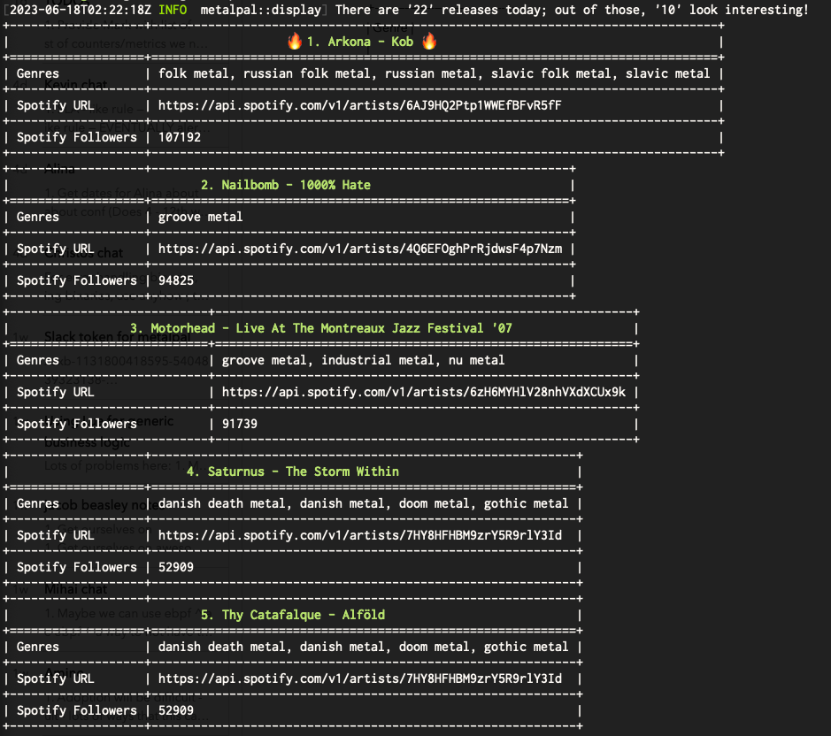

A rust re-write of a python-based bot I've been using for staying on top of new 
metal releases.

**BEWARE** I am using this project to learn rust...
## Logic
* Scrape loudwire for new releases
* Save releases to `~/.metalpal.json`
* Enrich releases with spotify artist data
* Enrich releases with MetalArchives / Metallum data
* Filter today's releases by genre (using whitelists and blacklists)
* Display matching releases
* Future: Send matching releases to Slack

## Output
This is roughly

## Todo

1. DONE: Go through questions in comments (noted with `Q: ...`)
2. DONE: Go over `async` and `await`
3. DONE: Figure out how to build & release
4. Go over what CI looks like
5. Go over benchmarking - how do you do it?
6. Go over testing - how do you do it?
